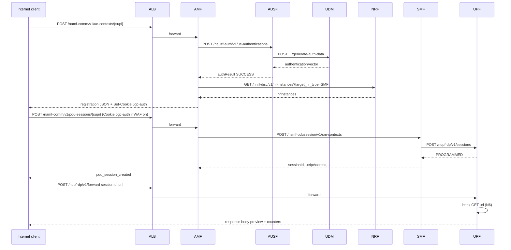

# 5G Core AWS Lab — Technical Handbook

This document is the **primary reference** for the lab: 5G concepts at the depth needed to reason about behavior and threats, **repository and code structure**, **AWS architecture**, **verification tests**, **attack simulations**, and **guidance for building a formal threat model** (assets, trust boundaries, mitigations, residual risk).

---

## Table of contents

1. [Purpose and scope](#1-purpose-and-scope)
2. [Repository structure](#2-repository-structure)
3. [5G Core theory (depth)](#3-5g-core-theory-depth)
4. [Software architecture — how the lab implements the core](#4-software-architecture--how-the-lab-implements-the-core)
5. [Per–network function reference](#5-per-network-function-reference)
6. [AWS implementation](#6-aws-implementation)
7. [Security posture: design vs production 5G](#7-security-posture-design-vs-production-5g)
8. [Threat modeling guide](#8-threat-modeling-guide)
9. [Verification tests (core functionality)](#9-verification-tests-core-functionality)
10. [Attack simulations](#10-attack-simulations)
11. [Optional edge WAF](#11-optional-edge-waf)
12. [Operational verification (CloudWatch, Flow Logs)](#12-operational-verification-cloudwatch-flow-logs)
13. [Deployment, defaults, and troubleshooting](#13-deployment-defaults-and-troubleshooting)
14. [References (3GPP and related)](#14-references-3gpp-and-related)

---

## 1) Purpose and scope

### What this lab is

- A **minimal, educational 5G Core** using **Service-Based Architecture (SBA)** patterns: six HTTP/JSON microservices representing **NRF, AMF, AUSF, UDM, SMF, UPF**, deployed on **AWS ECS (EC2 launch type)** behind an **internet-facing Application Load Balancer (ALB)** on **HTTP port 80**.
- It supports the **canonical control-plane + user-plane story**: **authenticate the UE → establish a PDU session → forward traffic through the UPF (N6)**.

### What it is not

- **Not** a standards-compliant commercial core (no full NAS, NGAP, PFCP, GTP-U, SEPP, NRF OAuth complexity, charging, lawful intercept, etc.).
- **Not** a RAN simulator (no gNB, no air interface).
- **Not** production-hardened security; several shortcuts exist **on purpose** to illustrate realistic classes of core/API abuse.

### Why AMF and UPF are public

Only **AMF** (`/namf-comm/*`, `/attach`, `/health`) and **UPF** (`/nupf-dp/*`) are routed through the ALB. That models a lab where an operator exposes **signaling** and a **user-plane diagnostic/test API** to the Internet—useful for **verification** and **red-team-style exercises**, but dangerous in production.

---

## 2) Repository structure

```
5gc-aws-lab/
├── docs/
│   └── 5gc-handbook.md          # This document
├── infra/
│   ├── netsec-base.yaml         # VPC, subnets, NAT, ALB, ECS cluster, ASG, Flow Logs
│   ├── core-services.yaml       # Six NFs on ECS, Cloud Map, SG rules, ALB listener rules
│   └── waf-5gc-edge.yaml      # Optional WAF Web ACL → ALB association
├── services/                    # One Python/FastAPI app per NF
│   ├── nrf/                     # Registry + discovery (in-memory)
│   ├── amf/                     # Registration + PDU orchestration, sets auth cookie
│   ├── ausf/                    # Auth broker → UDM
│   ├── udm/                     # Subscriber DB + auth vector generation (simulated)
│   ├── smf/                     # PDU session + “N4” programming of UPF
│   └── upf/                     # Session table + N6 forward API (lab primitive)
└── scripts/
    ├── deploy.ps1               # ECR build/push + core-services CloudFormation
    ├── undeploy.ps1             # Teardown helper (if present in your tree)
    ├── run-tests.ps1            # Verification Tests 1–3 + Attack 01–02 expectations
    ├── waf-toggle.ps1           # Deploy/delete WAF stack
    └── attack-simulations/      # Individual attack scripts + README
```

**Convention:** each service listens on **8080** inside the task; the ALB targets **8080** on task ENIs.

---

## 3) 5G Core theory (depth)

### 3.1 Service-Based Architecture (SBA)

3GPP defines the 5G Core as a set of **Network Functions (NFs)** that communicate over **HTTP/2** (often with **JSON** or other serialization) and **service discovery** (NRF). This replaced many 4G diameter/SCTP-style fixed interfaces with **named RESTful services** (e.g. `namf-comm`, `nausf-auth`). See **TS 23.501** for the service model and **TS 29.500** series for API details.

**In this lab:** all inter-NF calls are **plain HTTP** on port 8080 inside the VPC—sufficient to teach **call graphs** and **trust boundaries**, but not cryptographic channel security.

### 3.2 The six NFs and their roles

| NF   | 3GPP role (summary) | In this lab |
|------|---------------------|------------|
| **NRF** | NF repository: registration, discovery, subscription (in full 5G, with OAuth2) | In-memory registry; `PUT/PATCH/DELETE` profiles; `GET` discovery |
| **AMF** | Access and mobility; NAS with UE; talks to AUSF, SMF, PCF, etc. | Orchestrates **registration** (auth + NRF discovery) and **PDU session** (SMF) |
| **AUSF** | Authentication server; anchor for 5G-AKA with UDM/ARPF | Calls UDM for vectors; returns simplified **5G_AKA** payload |
| **UDM** | Subscription data, credentials (with AUSF/UDR) | Small `SUBSCRIBER_DB`; generates **simulated** vectors; **unknown SUPI** gets ephemeral keys |
| **SMF** | PDU session management, IP allocation, UPF control (N4/PFCP) | Allocates UE IP from `10.45.0.x`; **POST** to UPF to program session |
| **UPF** | User-plane forwarding, QoS, N6/N9 | In-memory **session table**; lab **`/forward`** API to HTTP-fetch a URL (N6 stand-in) |

### 3.3 Identifiers and sessions

- **SUPI** (Subscription Permanent Identifier): in the lab, **IMSI-style** strings such as `imsi-001010000000001`. In production, SUPI is confidential and often carried as **SUCI** (concealed) over the radio—this lab does not implement SUCI.
- **PDU Session**: a **user-plane context** between UE and data network (e.g. Internet) with a **UE IP**, **DNN**, **SNSSAI**. The SMF owns session state; the UPF enforces forwarding rules (**CUPS**: Control and User Plane Separation—**TS 23.501**).
- **DNN** (Data Network Name): e.g. `internet`, `ims`. The lab UPF applies a **simple policy**: `internet` may reach arbitrary URLs; other DNNs are restricted to `*.core.local` unless you extend the code.

### 3.4 Control paths vs user paths

- **N1/N2** (UE–RAN–AMF): not modeled.
- **N11** (AMF–SMF), **N8/N12** (AMF–UDM/AUSF paths): **collapsed** into AMF’s Python calls to AUSF/SMF.
- **N4** (SMF–UPF): in production this is **PFCP** (**TS 29.244**). Here it is **`POST /nupf-dp/v1/sessions`** with JSON.
- **N6** (UPF–DN): in production, routed IP traffic. Here it is **`POST /nupf-dp/v1/forward`** with a **`url`** field—an intentional **application-level** stand-in that makes SSRF lessons obvious.

### 3.5 5G-AKA (conceptual)

**TS 33.501** defines **5G-AKA** (and EAP-based variants). A full run involves the USIM/ME, ARPF in the home network, derivation of keys (`K_AUSF`, `K_SEAF`, etc.), and re-synchronization procedures.

**In this lab:**

1. UDM’s `generate-auth-data` returns `rand`, `autn`, `xresStar`, etc., using **hash-based simulation**, not crypto-compliant Milenage.
2. AUSF “succeeds” if the UDM call succeeds and returns structured data.

Treat lab output (`authType`, `authResult`, `5gAuthData`) as **pedagogical**, not interoperable with real UEs.

---

## 4) Software architecture — how the lab implements the core

### 4.1 End-to-end flow (legitimate client)



### 4.2 Security-group “graph” (who may talk to whom)

Microsegmentation in `core-services.yaml` enforces **least privilege at L4**:

- **ALB SG → AMF SG** and **ALB SG → UPF SG** on **TCP 8080** only.
- **AMF → NRF, AUSF, SMF**; **AUSF → NRF, UDM**; **UDM/SMF/UPF → NRF**; **SMF → UPF**.
- **AMF does not** have a rule to **UDM**; subscriber data is reachable **only via AUSF**, matching a common pattern (subscriber credentials not exposed directly to AMF).

### 4.3 Cloud Map (`core.local`)

Tasks register with **AWS Cloud Map** private DNS: `nrf.core.local`, `amf.core.local`, etc. Task definitions set env vars like `NRF_URL=http://nrf.core.local:8080` so services resolve peers **without hard-coded task IPs**.

### 4.4 The `5gc-auth` cookie (lab + WAF coupling)

On successful registration (`/namf-comm/v1/ue-contexts/{supi}`), the AMF sets an **HttpOnly cookie** `5gc-auth` whose value is an **HMAC-derived token** (first 32 hex chars) over `(supi + timestamp)` with secret `5GC_GW_SECRET` (default `lab-secret-change-me`).

- **Application layer:** The AMF **does not require** this cookie before creating a PDU session—the SMF/UPF chain runs regardless.
- **Edge WAF:** The optional WAF **requires** the substring `5gc-auth=` in the `Cookie` header for **`POST`** to paths containing `namf-comm/v1/pdu-sessions`. That enforces **“something happened on registration first”** at the perimeter—not full cryptographic proof of AKA completion.

### 4.5 N6 forward API — design intent and risk

`POST /nupf-dp/v1/forward` accepts **`sessionId`** and **`url`**. The UPF:

1. Checks the session exists and is **ACTIVE**.
2. Enforces **DNN policy** (public Internet vs internal-only hostnames).
3. Performs **`GET url`** via httpx (follows redirects), returns a **truncated body** (2000 chars) and updates **byte/packet counters**.

This is a deliberate **Server-Side Request Forgery (SSRF)** class primitive **when the URL is attacker-controlled** and the session can be obtained without strong subscriber proof—matching the lab’s **Attack 02**.

---

## 5) Per–network function reference

### 5.1 NRF (`services/nrf/app.py`)

- **State:** `NF_PROFILES` dict.
- **Notable APIs:**
  - `PUT /nnrf-nfm/v1/nf-instances/{id}` — register/update profile
  - `PATCH /nnrf-nfm/v1/nf-instances/{id}` — heartbeat
  - `DELETE /nnrf-nfm/v1/nf-instances/{id}` — deregister
  - `GET /nnrf-disc/v1/nf-instances?target_nf_type=SMF` — discovery filter
- **Legacy:** `POST /register`, `GET /discover/{name}`.

### 5.2 AMF (`services/amf/app.py`)

- **Startup:** Registers with NRF, periodic heartbeat.
- **`POST /namf-comm/v1/ue-contexts/{supi}`** — runs auth via AUSF + SMF discovery via NRF; sets `5gc-auth` cookie if auth step succeeded.
- **`POST /namf-comm/v1/pdu-sessions/{supi}`** — creates PDU via SMF (no server-side check for prior auth).
- **`POST /attach`** — legacy demo with fixed SUPI `imsi-001010000000001`.

### 5.3 AUSF (`services/ausf/app.py`)

- **`POST /nausf-auth/v1/ue-authentications`** — body: `supiOrSuci`, `servingNetworkName`; calls UDM `generate-auth-data`; returns simplified **5G_AKA** fields.

### 5.4 UDM (`services/udm/app.py`)

- **`SUBSCRIBER_DB`:** known IMSIs `...00001`, `...00002` with fake `authKey` / `opc`.
- **`POST .../generate-auth-data`** — if SUPI **unknown**, logs warning and **creates ephemeral** `authKey`/`opc`—so **“authentication” still succeeds** for arbitrary identities (important for **Threat: enumeration / fake subscribers**).
- **SDM stubs:** `GET .../nssai`, `GET .../am-data`.

### 5.5 SMF (`services/smf/app.py`)

- **`POST /nsmf-pdusession/v1/sm-contexts`** — allocates `sessionId` (UUID) and UE IP `10.45.0.x`, stores context, calls UPF `POST /nupf-dp/v1/sessions`.
- **`DELETE .../sm-contexts/{session_id}`** — tears down and calls UPF `DELETE`.

### 5.6 UPF (`services/upf/app.py`)

- **`POST /nupf-dp/v1/sessions`** — programs `SESSION_TABLE`.
- **`GET/DELETE /nupf-dp/v1/sessions`** — inspect/remove.
- **`POST /nupf-dp/v1/forward`** — SSRF-capable fetch; logs **`N6_EXTERNAL_REQUEST`** for non-`*.core.local` hosts (CloudWatch grep).

---

## 6) AWS implementation

### 6.1 Stacks and naming

| Stack (default name) | Template | Role |
|----------------------|----------|------|
| `netsec-base` | `infra/netsec-base.yaml` | VPC, public/private subnets, IGW, **NAT**, ALB:80, ECS cluster, ASG, instance profile, optional VPC Flow Logs |
| `core-services` | `infra/core-services.yaml` | ECR-backed task defs, **Cloud Map** `core.local`, **per-NF security groups**, ECS services, ALB listener rules |
| `waf-5gc` (optional) | `infra/waf-5gc-edge.yaml` | **WAFv2** regional Web ACL associated with ALB ARN |

Scripts default to **`us-east-2`**; override with parameters where supported.

**Note:** `scripts/waf-toggle.ps1` and `scripts/run-tests.ps1` use **`waf-5gc`** as the WAF stack name. If documentation elsewhere mentions `5gc-waf`, treat that as superseded by the script defaults.

### 6.2 Networking and “N6 realism”

- **Public subnets:** ALB, NAT gateway, ECS **container instances** (ASG places EC2 in public subnets per template).
- **Private subnets:** **UPF tasks only** (`UpfSubnet1/2`). Default route to **NAT** gives the UPF outbound Internet (lab **N6**).

### 6.3 ECS model

- **Launch type:** **EC2** (not Fargate).
- **Network mode:** `awsvpc` → each task gets an **ENI**; explains **ENI capacity** constraints on small instance types.
- **Logging:** Each NF has a CloudWatch log group `/5gc/<nf>` with short retention (3 days in template).

### 6.4 ALB routing

- **Rule priority 10:** paths `/attach`, `/health`, `/namf-comm/*` → AMF target group.
- **Rule priority 20:** `/nupf-dp/*` → UPF target group.
- **Default action:** fixed `404` “No route” — so **`/nnrf-nfm/*` via ALB** returns 404 (see Attack 06).

### 6.5 Deploy pipeline (`scripts/deploy.ps1`)

1. `docker login` to ECR.
2. Build and push **six** images to `$Account.dkr.ecr.$Region.amazonaws.com/5gc-lab:<nf>` (ensure the **ECR repository exists** in that region if first-time).
3. Read **`netsec-base` outputs** — uses **public subnets** for most NFs but **private subnets** for UPF (`PrivateSubnet1/2` outputs).
4. Create/update **`core-services`** stack; **force new ECS deployment** so tasks pull fresh images.

---

## 7) Security posture: design vs production 5G

### 7.1 What the lab does well (teaching value)

- **Microsegmentation** between NFs.
- **NRF not exposed** on the Internet path (listener default 404).
- **UPF on private subnets** with NAT egress (topology lesson).
- **Explicit WAF** demo for two abuse cases (cookie gate + metadata SSRF substring block).

### 7.2 Intentional weaknesses (threat-model drivers)

| Area | Lab behavior | Production expectation |
|------|----------------|------------------------|
| Transport | HTTP, no TLS between NFs | HTTPS, often mTLS between NFs; **TS 33.501** security architecture |
| NRF trust | No OAuth2 client credentials / JWT validation on NF calls | **TS 33.501** OAuth2 for SBA; NRF as authorization server |
| AMF PDU auth | No bind between PDU creation and successful AKA | Strict session state machines; NAS security context |
| UDM unknown SUPI | Ephemeral subscriber; auth still “works” | Reject unknown subscribers; audit and fraud controls |
| UPF forward | Any caller with `sessionId` can pick URL | No arbitrary URL fetch; N6 is routed IP, not HTTP pass-through |
| Edge | ALB HTTP:80 | TLS 1.2+, WAF, IAM-aware IMDS hardening, network ACLs on metadata |
| Rate limits | Not implemented | API GW / WAF rate-based rules / core internal throttles |

### 7.3 AWS-specific sensitivity

- **IMDS** (`169.254.169.254`) and **ECS task metadata** (`169.254.170.2`) are **link-local** services. If a workload can be tricked into **requesting** them with **attacker-influenced URLs**, credentials or task identity may leak. The lab WAF blocks those literals in the **`forward`** POST body—but **many other SSRF pivot targets** exist in real environments (internal HTTP services, cloud provider APIs via instance role, etc.).

---

## 8) Threat modeling guide

Use this section as a **checklist** when you produce STRIDE / PASTA / MITRE-style artifacts.

### 8.1 Primary assets

- **Subscriber identities (SUPI)** and **session identifiers (`sessionId`)**.
- **UDM subscriber database** (keys—even if simulated—represent **long-term credentials**).
- **NRF registry** (integrity of NF discovery — rogue SMF registration if compromised).
- **UPF forwarding capability** (egress to Internet and cloud metadata).
- **AWS credentials** reachable from tasks/instances (IMDS, task role, ECS agent).
- **Availability** of AMF/SMF/UPF (sessions per second, connection churn).

### 8.2 Trust boundaries

1. **Internet ↔ ALB** — untrusted clients.
2. **ALB ↔ AMF/UPF** — still untrusted at application layer (no mTLS in lab).
3. **Service mesh inside VPC** — “soft” trust; compromised task can lateral-move to allowed peers.
4. **AWS control plane** — CloudFormation, IAM, SSM (out of scope for app but in scope for org threat model).

### 8.3 MITRE / attack topics mapped to repo

| Topic | Manifestation in lab |
|------|----------------------|
| **T1190** Exploit public-facing app | HTTP APIs on AMF/UPF |
| **T1078** Valid accounts | Obtain `sessionId` via weak authz |
| **T1580** Cloud metadata | SSRF to IMDS/ECS metadata via `forward` |
| **T1499** Endpoint DoS | `05-dos-stress.ps1` |
| **Identity abuse** | `04-supi-enumeration.ps1`, unknown SUPI in UDM |

### 8.4 Mitigations (beyond the demo WAF)

- **Never expose** SMF/UPF admin or diagnostic APIs publicly in production.
- **mTLS + OAuth2** between NFs; NRF-issued tokens; audience validation.
- **PDU session:** enforce AMF security context / SMF policy binding to authenticated SUPI.
- **UPF:** strip proxy-like behaviors; strictly forward only subscriber traffic shapes; use **egress filtering**, **IMDSv2** with hop limit, **no public IP on sensitive tasks** where possible.
- **Rate limiting** at edge and per-NF; **AWS Shield Advanced** / WAF rate rules as needed.
- **Logging:** CloudWatch + VPC Flow Logs + **WAF sampled requests**; central SIEM.

### 8.5 WAF limitations (for accurate residual risk)

- Rules are **string-based** (path contains, cookie contains, body contains IP literals). **Encoding tricks**, **fragmentation**, alternate IP forms, or **SSRF chains** via non-blocklisted hosts may **bypass** simplistic filters.
- **Cookie presence ≠ cryptographic auth.** An attacker who completes registration once might reuse cookies; a forged cookie is irrelevant here only because the **app does not verify** the HMAC—**the WAF only checks substring `5gc-auth=`**.

---

## 9) Verification tests (core functionality)

Run **`.\scripts\run-tests.ps1`** from the repo (reads **`netsec-base`** ALB DNS, detects **`waf-5gc`** stack).

### 9.1 Test 1 — UE authentication (5G-AKA surrogate)

`POST /namf-comm/v1/ue-contexts/imsi-001010000000001` with JSON body including `supi` and `servingNetworkName`.

**Pass criteria:**

- Response `event` is `ue_initial_registration`.
- `registration_steps` contains **authentication** `success` and **smf_discovery** `success`.
- `run-tests.ps1` keeps a **`WebSession`** so **`5gc-auth`** is sent on Test 2 when the WAF is on.

### 9.2 Test 2 — PDU session establishment

`POST /namf-comm/v1/pdu-sessions/imsi-001010000000001` with `{}`.

**Pass criteria:**

- `event` is `pdu_session_created`.
- `session.sessionId` present, `session.sessionStatus` is `ACTIVE`.
- Nested `session.upfAck.status` should be **`PROGRAMMED`** when UPF is reachable.

### 9.3 Test 3 — Data forwarding (N6 via `forward`)

`POST /nupf-dp/v1/forward` with `sessionId` from Test 2 and `url` (HTTPS to `httpbin.org/get` in the bundled script).

**Pass criteria:**

- `response.statusCode == 200`, `counters.packetCount >= 1`.

### 9.4 Manual ALB DNS query (PowerShell)

```powershell
$ALB_DNS = (aws cloudformation describe-stacks `
  --stack-name netsec-base --region us-east-2 `
  --query "Stacks[0].Outputs[?OutputKey=='AlbDNS'].OutputValue" `
  --output text)
```

---

## 10) Attack simulations

All scripts live under **`scripts/attack-simulations/`**. Use **only in environments you own**.

### 10.1 Priority attacks (also automated in `run-tests.ps1`)

| ID | File | Technique | Expected without WAF | Expected with WAF |
|----|------|-----------|----------------------|-------------------|
| **01** | `01-pdu-without-auth.ps1` | `POST` PDU without registration/cookie | Session created (authz bypass) | **403** (no `5gc-auth` cookie) |
| **02** | `02-upf-ssrf.ps1` | `forward` to `http://169.254.169.254/...` | UPF may return metadata (or 502 if unreachable) | **403** (body contains blocked IP) |

### 10.2 Extended lab attacks (manual / extra scenarios)

| ID | File | Teaching goal |
|----|------|---------------|
| **04** | `04-supi-enumeration.ps1` | **Enumeration**: multiple SUPIs get registration + PDU; unknown SUPI still gets “auth” via UDM ephemeral profile |
| **05** | `05-dos-stress.ps1` | **Lack of rate limiting**: concurrent PDU `POST`s |
| **06** | `06-rogue-nrf.ps1` | **NRF not on ALB** (404). Notes **residual**: from inside VPC, `http://nrf.core.local:8080` could register rogue NFs unless stronger auth exists |

### 10.3 Core flow vs attack flow (mental model)

- **Verification** proves “happy path” works.
- **Attack 01** proves **session creation does not require** prior auth **at the AMF** when WAF is off.
- **Attack 02** proves **sessionId + forward** yields **SSRF** from the UPF’s network position.

---

## 11) Optional edge WAF

**Template:** `infra/waf-5gc-edge.yaml`  
**Toggle:** `.\scripts\waf-toggle.ps1 -Enable | -Disable | -Status`

### Rules (summary)

1. **`BlockPduWithoutAuthCookie`** — For `POST` where URI contains `namf-comm/v1/pdu-sessions`, **block** unless `Cookie` header contains `5gc-auth=`.
2. **`BlockForwardMetadataSsrF`** — For `POST` where URI contains `nupf-dp/v1/forward`, **block** if body contains **`169.254.169.254`** or **`169.254.170.2`**.

**Design note:** HTTPS is **not** blocked globally because legitimate N6 tests use **`https://`**. Only **sensitive metadata literals** are blocked.

### Behavior matrix

| Scenario | Tests 1–3 | Attack 01 | Attack 02 |
|----------|-----------|-----------|-----------|
| WAF **off** | PASS | Succeeds (vulnerable) | Likely succeeds / environment-dependent |
| WAF **on** | PASS (cookie flow) | **403** | **403** |

---

## 12) Operational verification (CloudWatch, Flow Logs)

### 12.1 UPF external fetch logs

1. **CloudWatch → Log groups → `/5gc/upf`**
2. Run **Test 3** or **Attack 02**.
3. Search **`N6_EXTERNAL_REQUEST`** or the target URL / IP.

### 12.2 VPC Flow Logs

If enabled in **`netsec-base`**, inspect the Flow Logs log group output. Correlate **UPF task ENI** traffic to **public IPs** (e.g. destination **443** for `httpbin.org`) during Test 3.

---

## 13) Deployment, defaults, and troubleshooting

### 13.1 Order

1. Deploy **`netsec-base`** (use **`CAPABILITY_NAMED_IAM`** if templates attach IAM resources).
2. Ensure **ECR repository** `5gc-lab` (or your chosen name) exists if `deploy.ps1` assumes it.
3. **`.\scripts\deploy.ps1`**
4. Wait **2–3 minutes** for stability; run **`.\scripts\run-tests.ps1`**
5. Optionally **`.\scripts\waf-toggle.ps1 -Enable`**

### 13.2 ECS `RESOURCE:ENI` / tasks stuck

**`awsvpc`** tasks consume **ENIs**. On **`t3.micro`**, six tasks may exceed capacity. Template **`netsec-base`** allows **`t3.small`**—use it and cycle ASG instances after change.

### 13.3 Region and stack name drift

Keep **`netsec-base`**, **`core-services`**, and **`waf-5gc`** consistent with your CLI/profile. Scripts default **`us-east-2`**.

---

## 14) References (3GPP and related)

| Document | Relevance |
|----------|-----------|
| **TS 23.501** | 5G system architecture, SBA, procedures |
| **TS 33.501** | Security architecture, 5G-AKA, service-layer auth |
| **TS 29.518** | AMF services (`namf-comm`) |
| **TS 29.509** | AUSF services |
| **TS 29.503** | UDM services |
| **TS 29.502** | SMF services |
| **TS 29.510** | NRF (NNRF_NFM / NNRF_DISC) |
| **TS 29.244** | N4 / PFCP (contrast with lab HTTP) |

**Repo scripts:** `scripts/deploy.ps1`, `scripts/run-tests.ps1`, `scripts/waf-toggle.ps1`, `scripts/attack-simulations/`.

---

## Document history

This handbook subsumes the earlier “single short document” version: it adds **repository layout**, **deep-dive theory**, **per-NF behaviors**, **AWS details**, **extended threats (04–06)**, and **threat-modeling scaffolding** suitable for building a formal **5GC-on-AWS** threat model.
